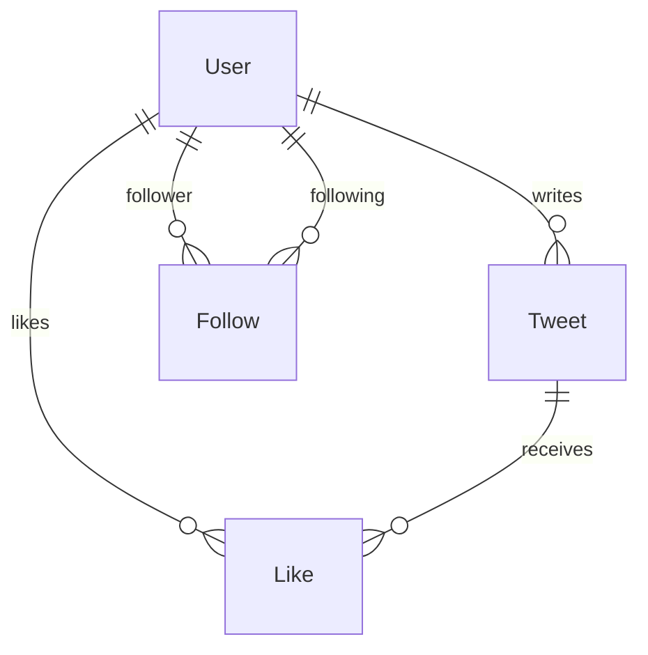

# Twitter/X Clone — Full-Stack

A full-stack Twitter/X clone built with TypeScript, featuring custom authentication, a social graph (follow/like system), paginated timeline, user search, responsive mobile-first design, and a Docker Compose production stack.

---

## Stack Justification

| Layer | Technology | Rationale |
|-------|-----------|-----------|
| **Runtime** | Node.js 24 | LTS, native ESM, excellent agentic tooling compatibility (tsx, vitest). |
| **Language** | TypeScript (strict) | End-to-end type safety across backend and frontend; reduces context-switching for AI agents. |
| **Backend framework** | Express.js 5 | Minimal, widely understood routing layer; no magic — easy for an agent to reason about request/response flow. |
| **ORM** | Prisma 6 | Declarative schema → type-safe client generation; ideal for rapid schema evolution and migrations. Supports SQLite (dev) and PostgreSQL (Docker). |
| **Frontend** | React 19 + Vite 6 | Component model maps naturally to UI state; Vite provides instant HMR and first-class TypeScript/JSX support. |
| **Styling** | Vanilla CSS (mobile-first) | Zero-dependency approach to custom dark theme, radial gradients, micro-animations (likePop, fadeIn), and three-breakpoint responsive layout. |
| **Auth** | Custom (bcryptjs + jsonwebtoken) | Mandated by challenge constraints. No external auth services. Passwords hashed with bcrypt (salt rounds: 10), sessions via JWT Bearer tokens (7-day expiry). |
| **Testing (unit/integration)** | Vitest + Supertest | Blazing-fast native ESM test runner. Supertest provides HTTP assertions without spinning up a full server. |
| **Testing (E2E)** | Playwright | Industry-standard browser automation; covers auth, tweet creation, follow/like flows. |
| **Containerization** | Docker Compose | Single-command production stack with PostgreSQL 16, backend, and nginx-served frontend. |

---

## Architecture Decisions

### Timeline Query Model

The home timeline displays tweets from the authenticated user and users they follow, sorted reverse-chronologically. The query uses a single SQL `IN` clause rather than a join graph walk:

```sql
SELECT t.*, u.username, u.name, u.avatarUrl
FROM tweets t
JOIN users u ON t.userId = u.id
WHERE t.userId IN (
    SELECT followingId FROM follows WHERE followerId = :currentUserId
) OR t.userId = :currentUserId
ORDER BY t.createdAt DESC
LIMIT :limit OFFSET :offset;
```

Pagination is offset-based (`limit` / `offset` query params, max 100 per page), enabling a "Load More" UX on the frontend.

### Social Graph: Follows & Likes

Two join tables model the social graph, each with a **composite unique constraint** to prevent duplicates at the database level:

- **Follows** — `@@unique([followerId, followingId])`. Self-referential many-to-many on `User`. The controller rejects self-follows before the DB query.
- **Likes** — `@@unique([userId, tweetId])`. Links `User` ↔ `Tweet`. Like/unlike toggles are idempotent; the API returns the current `likesCount` on every mutation.



### Responsive Layout

Mobile-first CSS with three breakpoints:

| Breakpoint | Layout |
|-----------|--------|
| < 640px | Bottom navigation bar, single-column content |
| 640–1024px | Compact sidebar (icons only), single-column content |
| > 1024px | Full sidebar (icons + labels), right sidebar (search + trends) |

---

## Custom Auth Flow

1. **Registration** — Client sends `{ email, username, password, name }`. Backend validates format (email regex, username ≥ 3 chars / alphanumeric, password ≥ 6 chars), checks uniqueness of email and username, hashes password with `bcrypt.genSalt(10)` + `bcrypt.hash()`, stores user, returns a signed JWT.
2. **Login** — Client sends `{ emailOrUsername, password }`. Backend looks up user by email or username (case-insensitive), compares hash with `bcrypt.compare()`, returns a signed JWT on success.
3. **Session** — The JWT (7-day expiry, signed with `JWT_SECRET`) is stored in `localStorage` and sent as `Authorization: Bearer <token>` on every authenticated request.
4. **Middleware** — `authMiddleware.ts` extracts the token, verifies with `jwt.verify()`, fetches the user from the database, and attaches the safe user object to `req.user`. Protected routes return 401 if the token is missing, invalid, or expired.
5. **Logout** — Stateless: the frontend removes the token from `localStorage`. The backend clears the `Set-Cookie` header (if using cookies) and returns a confirmation.

---

## Trade-offs & Known Limitations

| Decision | Trade-off |
|---|---|
| **JWT in `localStorage`** | Simpler than HttpOnly cookies but vulnerable to XSS. Production-grade alternative: HttpOnly + Secure + SameSite=Strict cookies plus a CSRF token. |
| **Stateless logout** | `POST /api/auth/logout` is a no-op on the server. JWTs remain valid until expiry. A revocation list (Redis) would be needed to truly invalidate tokens. |
| **Offset-based pagination** | Simple to implement and reason about, but degrades on large datasets (deep offsets scan many rows). Cursor-based pagination keyed on `(createdAt, id)` is the next step for scale. |
| **Custom navigation context** | No `react-router-dom`, so URLs are not deep-linkable (e.g. `/profile/:username` can't be shared) and browser back/forward doesn't track in-app state. Chosen to keep dependencies minimal; would migrate to react-router in a real product. |
| **No service layer** | Controllers call Prisma directly. Adequate for the current scope; a `services/` layer would be the next refactor if business rules grow (notifications, derived stats). |
| **Hand-rolled validation** | Express controllers validate inputs by hand. `zod` would give a single source of truth and richer error reporting. |
| **Two Prisma schemas** | `schema.prisma` (SQLite, dev) and `schema.postgres.prisma` (Postgres, Docker). Prisma does not support a single schema with a provider switch via env var. The schemas are kept in sync manually. |
| **Like/follow return 409 on duplicates** | The endpoints are not idempotent. A future revision could flip the response to a 200 with the current state for cleaner client semantics. |
| **Rate limit only on `/login` and `/register`** | Single-instance in-memory store. For multi-instance deploys, swap to a shared store (Redis) and consider per-IP+per-user composite keys. |
| **CORS open by default** | `cors()` allows any origin — convenient for dev. Restrict to the frontend origin in production. |
| **Frontend integration tests over true E2E** | Backend has Supertest integration tests; frontend uses `@testing-library/react` with mocked `fetch`. Playwright covers the cross-tier flows (auth, tweets, social, timeline). |

---

## AI Tooling & Development Process

The project was built end-to-end with agentic coding, using a **three-role multi-agent workflow** rather than a single chat. Each model was picked for what it does best:

| Role | Tool / Model | What it actually did |
|---|---|---|
| **Planner / Reviewer** | Google Gemini inside the **Antigravity IDE** | Evaluated each upcoming phase, stress-tested the SDD, surfaced edge cases and missing requirements before any code was written. Acted as a "second pair of eyes" on the plan. |
| **Implementer** | DeepSeek inside **OpenCode** | Executed the validated plan: scaffolding, feature implementation, tests, and the progressive commit history you see from `c0f602f` to `e87141b`. |
| **Architect / Refactorer** | Anthropic Claude (Opus 4.7) inside **Claude Code** | Final audit pass: identified duplicated logic and architectural smells (controller boilerplate, repeated tweet DTO shaping, fetch boilerplate across React components), executed the refactor, raised backend coverage from 85% to 96.74%, and closed the "tweets on profile" gap. Visible from commit `00bb6af` onward. |

### The loop at a glance

```
                     ┌──────────────────────┐
                     │      SDD.md          │
                     │  (single source of   │
                     │       truth)         │
                     └──────────┬───────────┘
                                │
                ┌───────────────┴───────────────┐
                ▼                               ▲
   ┌────────────────────────┐                  │
   │  Gemini  (Antigravity) │                  │
   │  PLAN + REVIEW         │                  │
   │  • stress-test phase   │                  │
   │  • surface edge cases  │                  │
   └────────────┬───────────┘                  │
                │ validated plan               │
                ▼                              │ updates SDD
   ┌────────────────────────┐                  │ if needed
   │  DeepSeek (OpenCode)   │                  │
   │  IMPLEMENT             │                  │
   │  • feature + tests     │                  │
   │  • semantic commit     │                  │
   └────────────┬───────────┘                  │
                │ green tests                  │
                ▼                              │
   ┌────────────────────────┐                  │
   │  Local verify          │──── fail ────────┘
   │  npm test + manual     │
   └────────────┬───────────┘
                │ pass
                ▼
       (next phase) ──────► … ──────► all phases done
                                            │
                                            ▼
                          ┌────────────────────────────┐
                          │ Claude  (Claude Code)      │
                          │ AUDIT + REFACTOR (final)   │
                          │ • mappers, error mw        │
                          │ • apiClient, components    │
                          │ • atomic commits, coverage │
                          └────────────────────────────┘
```

### Single source of truth: `SDD.md`

Instead of free-form prompts, a structured **Software Design Document** ([`SDD.md`](./SDD.md)) was authored upfront with the database model, API contract, phase-by-phase task plan, and explicit DO/DON'T rules (no squash, no third-party auth, tests-with-features, mobile-first). Every prompt to every agent referenced this document — this is what kept patterns consistent across model handoffs and what made each commit traceable to a planned phase.

### How the loop actually worked, per phase

1. **Plan** — Ask Gemini (Antigravity) to read the next SDD phase and challenge it: missing fields, edge cases, test coverage gaps.
2. **Validate** — Manually review Gemini's feedback against the SDD; update the SDD if the feedback was sound, otherwise reject it.
3. **Implement** — Hand the validated plan to DeepSeek (OpenCode), which produced code + tests + a phase commit.
4. **Verify** — Run the test suite locally; only move to the next phase when green.
5. **Refactor (final pass)** — Claude Code audited the finished codebase, proposed an ordered punch list (mapper extraction, central error middleware, apiClient with 401 auto-logout, Avatar/TweetCard reuse, JWT fail-fast, rate limit), executed it as 11 atomic commits, and verified coverage didn't regress.

### What was **not** delegated

Some decisions were kept off the AI's plate on purpose:

- **Stack choice and justification** (Node/Express/Prisma/React + Vite/SQLite-Postgres).
- **Database modeling** — composite uniqueness on `(followerId, followingId)` and `(userId, tweetId)`, the timeline query strategy (`IN` over followed-ids), and the dual `schema.prisma` / `schema.postgres.prisma` approach.
- **Security posture** — bcrypt salt rounds, JWT expiry, the decision to fail-fast on `JWT_SECRET` in production, and the choice of `localStorage` vs HttpOnly cookies (the latter is documented as a deliberate trade-off, not an oversight).
- **What to refactor vs. what to leave as documented trade-off** — service layer, zod, react-router and HttpOnly cookies were *evaluated* and consciously deferred with reasoning in the Trade-offs table.
- **Final review of every commit** before push, including reading the diff, not just the test result.

### Why three models instead of one

Concretely: Gemini caught planning gaps that the implementer would have papered over; DeepSeek shipped consistent code fast against a vetted plan; Claude was used last because its strength is large-context architectural review and atomic multi-file refactors. Using a single model for all three roles tends to produce confirmation bias (the planner approves what the implementer already wants to write). Splitting roles forces an adversarial check at every step.

---

## Project Structure

```
├── backend/
│   ├── prisma/
│   │   ├── schema.prisma          # SQLite schema (local dev)
│   │   ├── schema.postgres.prisma # PostgreSQL schema (Docker)
│   │   └── seed.ts                # Seed script (12 users, 36 tweets)
│   ├── src/
│   │   ├── controllers/           # Route handlers (throw HttpError, no try/catch boilerplate)
│   │   ├── mappers/               # DTO shapers (toTweetDTO + tweetIncludeFor)
│   │   ├── middlewares/           # Auth + central error middleware
│   │   ├── routes/                # Express routers (auth router has rate limiter)
│   │   ├── tests/                 # Backend integration tests
│   │   ├── app.ts                 # Express app setup
│   │   ├── config.ts              # JWT secret (fail-fast in production)
│   │   ├── db.ts                  # Prisma client singleton
│   │   └── index.ts               # Server entry point
│   ├── Dockerfile
│   └── package.json
├── frontend/
│   ├── e2e/                       # Playwright E2E tests (4 specs)
│   ├── src/
│   │   ├── api/                   # Central apiClient (Bearer injection, 401 auto-logout)
│   │   ├── components/            # React components (Avatar, TweetCard reused across views)
│   │   ├── context/               # Auth + Navigation contexts
│   │   ├── tests/                 # Frontend integration tests
│   │   └── index.css              # Mobile-first responsive CSS
│   ├── nginx.conf                # Production nginx proxy config
│   ├── Dockerfile
│   ├── playwright.config.ts
│   └── package.json
├── docker-compose.yml            # PostgreSQL + backend + frontend
├── .env.example                  # Environment variable template
├── SDD.md                        # Software Design Document
└── README.md
```
