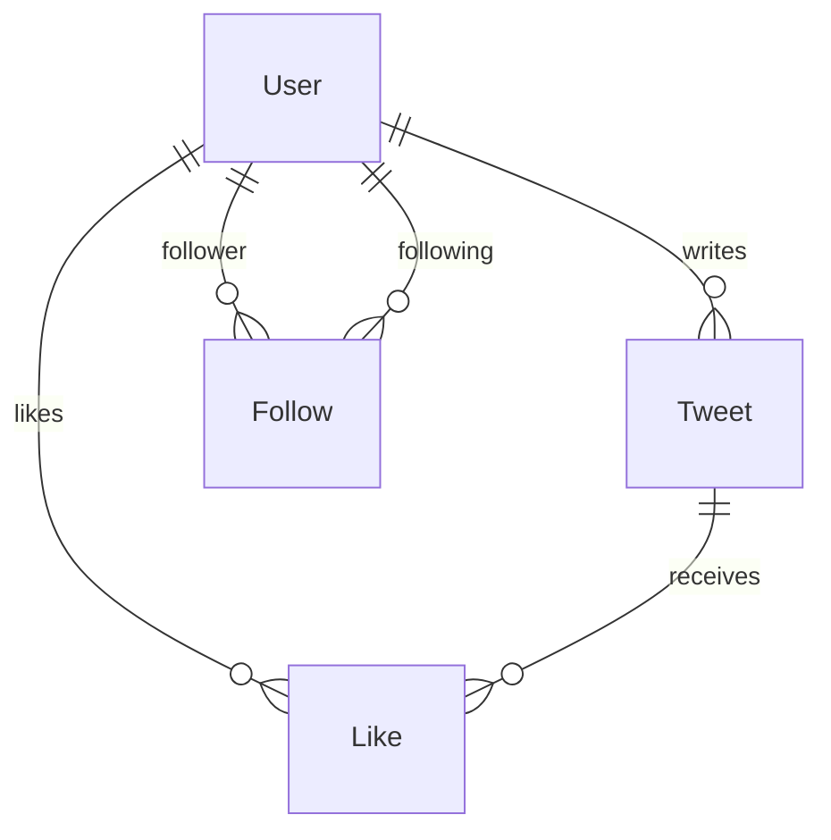

# Twitter/X Clone — Full-Stack

A full-stack Twitter/X clone built with TypeScript, featuring custom authentication, a social graph (follow/like system), paginated timeline, user search, **real-time timeline updates via Server-Sent Events**, responsive mobile-first design, and a Docker Compose production stack.

---

## Stack Justification

| Layer | Technology | Rationale |
|-------|-----------|-----------|
| **Runtime** | Node.js 24 | LTS, native ESM, excellent agentic tooling compatibility (tsx, vitest). |
| **Language** | TypeScript (strict) | End-to-end type safety across backend and frontend; reduces context-switching for AI agents. |
| **Backend framework** | Express.js 5 | Minimal, widely understood routing layer; no magic — easy for an agent to reason about request/response flow. |
| **ORM** | Prisma 6 | Declarative schema → type-safe client generation; ideal for rapid schema evolution and migrations. Supports SQLite (dev) and PostgreSQL (Docker). |
| **Frontend** | React 19 + Vite 6 | Component model maps naturally to UI state; Vite provides instant HMR and first-class TypeScript/JSX support. |
| **Styling** | Vanilla CSS (mobile-first) | Zero-dependency approach to custom dark theme, radial gradients, micro-animations (likePop, fadeIn), and three-breakpoint responsive layout. |
| **Auth** | Custom (bcryptjs + jsonwebtoken) | Mandated by challenge constraints. No external auth services. Passwords hashed with bcrypt (salt rounds: 10), sessions via JWT Bearer tokens (7-day expiry). |
| **Testing (unit/integration)** | Vitest + Supertest | Blazing-fast native ESM test runner. Supertest provides HTTP assertions without spinning up a full server. |
| **Testing (E2E)** | Playwright | Industry-standard browser automation; covers auth, tweet creation, follow/like flows. |
| **Containerization** | Docker Compose | Single-command production stack with PostgreSQL 16, backend, and nginx-served frontend. |
| **Real-time** | Server-Sent Events (native) | One-directional push (server→client) for new tweets in the timeline. Simpler than WebSocket, plain HTTP, browser-native reconnection. No new dependencies. |

---

## Architecture Decisions

### Timeline Query Model

The home timeline displays tweets from the authenticated user and users they follow, sorted reverse-chronologically. The query uses a single SQL `IN` clause rather than a join graph walk:

```sql
SELECT t.*, u.username, u.name, u.avatarUrl
FROM tweets t
JOIN users u ON t.userId = u.id
WHERE t.userId IN (
    SELECT followingId FROM follows WHERE followerId = :currentUserId
) OR t.userId = :currentUserId
ORDER BY t.createdAt DESC
LIMIT :limit OFFSET :offset;
```

Pagination is offset-based (`limit` / `offset` query params, max 100 per page), enabling a "Load More" UX on the frontend.

### Social Graph: Follows & Likes

Two join tables model the social graph, each with a **composite unique constraint** to prevent duplicates at the database level:

- **Follows** — `@@unique([followerId, followingId])`. Self-referential many-to-many on `User`. The controller rejects self-follows before the DB query.
- **Likes** — `@@unique([userId, tweetId])`. Links `User` ↔ `Tweet`. Like/unlike toggles are idempotent; the API returns the current `likesCount` on every mutation.



### Real-time Timeline (SSE)

When a user posts a tweet, every connected follower (and the author) receives a `tweet:new` event over a Server-Sent Events stream. The frontend buffers incoming events and surfaces them as a sticky **"N new tweets — click to view"** banner above the feed — never auto-inserting, to avoid jarring mid-scroll content shifts.

```
                       HTTP POST /api/tweets
   browser  ──────────────────────────────────►  Express
                                                    │
                                                    ▼
                                          tweet.service.createTweet
                                                    │ (fire-and-forget)
                                                    ▼
                                      publishTweetToFollowers(tweet, authorId)
                                                    │
                              ┌─────────────────────┼─────────────────────┐
                              ▼                     ▼                     ▼
                       sub: follower1        sub: follower2        sub: author
                              │                     │                     │
                              └─── SSE: tweet:new ──┴─────────────────────┘
                                                    │
                                                    ▼
                                          banner appears in Home
```

**Why SSE over WebSocket.** The use case is one-directional server→client push. WebSocket's full-duplex channel is wasted here, costs an `Upgrade` handshake, adds reconnection plumbing, and is easier to misconfigure in corporate proxies. SSE is plain HTTP, reconnects automatically with exponential backoff (browser-native), and works transparently through standard HTTP infrastructure. The right tool for the job is the simpler one.

**Auth on the stream.** `EventSource` cannot send custom headers, so the SSE endpoint accepts the JWT via `?token=` query parameter in addition to the `Authorization` header. The trade-off (tokens in URLs can leak into access logs) is documented at the top of `sseAuth.middleware.ts` along with the production-grade follow-up: a short-lived "stream ticket" endpoint that mints a 60-second token bound to that connection.

**Scope.** The subscriber registry is an in-memory `Map<userId, Set<Subscriber>>` — single-instance only. The Redis-pubsub swap is a ~30-line change isolated to `realtime.service.ts`.

### Responsive Layout

Mobile-first CSS with three breakpoints:

| Breakpoint | Layout |
|-----------|--------|
| < 640px | Bottom navigation bar, single-column content |
| 640–1024px | Compact sidebar (icons only), single-column content |
| > 1024px | Full sidebar (icons + labels), right sidebar (search + trends) |

---

## Bonus Features Implemented

The brief lists 5 optional bonuses and asks for "one or two". Two are implemented end-to-end:

| Bonus | Where | What it adds |
|---|---|---|
| **Real-time updates** | `services/realtime.service.ts` + `controllers/realtime.controller.ts` + `api/useTimelineStream.ts` | SSE-based broadcast of new tweets to followers + author. Sticky in-feed banner with click-to-prepend. 13 backend + 2 frontend tests cover the path. See [Real-time Timeline (SSE)](#real-time-timeline-sse) for the architecture rationale. |
| **Docker** | `docker-compose.yml` + `backend/Dockerfile` + `frontend/Dockerfile` | Single-command stack (`docker compose up --build`) with PostgreSQL 16, hardened secrets via env interpolation, healthchecks, and the seed auto-running on first boot. |

---

## Custom Auth Flow

1. **Registration** — Client sends `{ email, username, password, name }`. A `zod` schema (`schemas/auth.schema.ts`) validates format (email, username ≥ 3 chars alphanumeric, password ≥ 6 chars) before the controller ever runs. `authService.registerUser` checks uniqueness of email + username, hashes the password with `bcrypt` (10 salt rounds), stores the user, and returns a signed JWT.
2. **Login** — Client sends `{ emailOrUsername, password }`. A `zod` schema enforces that the identifier and password are present. The service looks up the user (case-insensitive email or username), compares the hash with `bcrypt.compare()`, and returns a JWT on success — or a generic `401 Invalid email/username or password` on failure (no enumeration of which field was wrong).
3. **Session** — The JWT (7-day expiry, signed with `JWT_SECRET` using `HS256` pinned explicitly) is stored in `localStorage` on the client and sent as `Authorization: Bearer <token>` on every authenticated request via the central `apiClient`.
4. **Middleware** — `authMiddleware.ts` extracts the token, verifies it with `jwt.verify(token, JWT_SECRET, { algorithms: ["HS256"] })`, fetches the user from the database (so deleted/disabled users are kicked out even if their token is still cryptographically valid), and attaches a `SafeUser` to `req.user`. Protected routes are typed as `AuthenticatedRequest` so the compiler guarantees `req.user` is present (no `req.user!` non-null assertions).
5. **Brute-force protection** — `/register` and `/login` are wrapped in a stricter `authLimiter` (20 requests / 15 min / IP). Mutating endpoints (tweet create/delete, follow, like) are wrapped in a generous `mutationLimiter` (60 requests / min / IP).
6. **Logout** — Stateless on the server. The client clears the token from `localStorage` (and the `apiClient` auto-triggers logout on any 401 from any endpoint).

---

## Security Posture

What's actively implemented on the backend (not just "could be done"):

| Area | Implementation |
|---|---|
| **Password storage** | `bcrypt` with 10 salt rounds. The hash is stripped from every response by the service layer (verified by two tests). |
| **JWT signing & verification** | `HS256` pinned explicitly on both sign and verify to block algorithm-confusion attacks. 7-day expiry. |
| **JWT secret handling** | Backend refuses to boot in `NODE_ENV=production` if `JWT_SECRET` is unset. If the secret matches one of the known-weak demo defaults, a loud warning is logged at startup. |
| **Input validation** | `zod` schemas at the route boundary. Controllers receive already-validated, type-narrowed bodies via `z.infer`. |
| **Authorization** | `authMiddleware` + `AuthenticatedRequest` + `requireAuth` wrapper — TypeScript guarantees `req.user` exists in protected handlers. Tweet delete additionally checks ownership in the service. |
| **Email privacy** | `GET /api/users/:id` only returns the `email` field when the requester is the profile owner (covered by two tests). |
| **SQL injection** | All queries go through Prisma's parameterized client — string concatenation into SQL is structurally impossible. |
| **XSS** | React escapes interpolated content by default; the codebase contains **zero** `dangerouslySetInnerHTML`. |
| **CSRF** | JWT is sent in the `Authorization` header (not a cookie), so cross-origin form posts cannot impersonate the user. |
| **HTTP headers** | `helmet()` at the top of the middleware chain sets `X-Content-Type-Options: nosniff`, `X-Frame-Options: DENY`, `Strict-Transport-Security`, `Referrer-Policy`, and removes `X-Powered-By`. |
| **Payload limits** | `express.json({ limit: "10kb" })` — the largest legitimate body is a 280-char tweet. |
| **Rate limiting** | `/login` and `/register` capped at 20 req / 15 min / IP. Every mutating endpoint (`POST` tweets, `POST` follow, `POST` like, etc.) capped at 60 req / min / IP. |
| **Login error messages** | Generic `Invalid email/username or password` — does not reveal which field was wrong. |
| **Centralized error middleware** | All thrown `HttpError`s become safe JSON responses. Unexpected errors return a generic 500 — no stack traces or internal field names ever cross the wire. |

## Trade-offs & Known Limitations

Things deliberately not implemented, with the reasoning:

| Decision | Trade-off |
|---|---|
| **JWT in `localStorage`** | Simpler than HttpOnly cookies but vulnerable to XSS. Production-grade alternative: HttpOnly + Secure + SameSite=Strict cookies plus a CSRF token. The XSS surface is small here (no `dangerouslySetInnerHTML`, no third-party rich-text), so the trade was acceptable for the scope. |
| **Stateless logout** | `POST /api/auth/logout` is a no-op on the server. JWTs remain valid until expiry. A revocation list (Redis) would be needed to truly invalidate tokens before the 7-day window. |
| **Offset-based pagination** | Simple to implement and reason about, but degrades on large datasets (deep offsets scan many rows). Cursor-based pagination keyed on `(createdAt, id)` is the next step for scale. |
| **Custom navigation context** | No `react-router-dom`, so URLs are not deep-linkable (e.g. `/profile/:username` can't be shared) and browser back/forward doesn't track in-app state. Chosen to keep dependencies minimal; would migrate to react-router in a real product. |
| **Two Prisma schemas** | `schema.prisma` (SQLite, dev) and `schema.postgres.prisma` (Postgres, Docker). Prisma does not support a single schema with a provider switch via env var; the schemas are kept in sync manually. |
| **In-memory rate-limit store** | `express-rate-limit` uses an in-process counter — fine for a single backend instance, but in a multi-instance deploy you'd swap to Redis-backed storage and consider per-IP+per-user composite keys. |
| **CORS open by default** | `cors()` allows any origin — convenient for dev. Should be restricted to the frontend origin via env var in any real deployment. |
| **Frontend integration tests over true E2E** | Backend has Supertest integration tests; frontend uses `@testing-library/react` with mocked `fetch`. Playwright covers the cross-tier flows (auth, tweets, social, timeline). |
| **Registration error reveals which field collided** | Returning `Email is already registered` vs `Username is already taken` is a small enumeration vector. Kept for UX clarity; an email-confirmation flow would be the real fix. |

---

## AI Tooling & Development Process

The project was built end-to-end with agentic coding, using a **three-role multi-agent workflow** rather than a single chat. Each model was picked for what it does best:

| Role | Tool / Model | What it actually did |
|---|---|---|
| **Planner / Reviewer** | Google Gemini inside the **Antigravity IDE** | Evaluated each upcoming phase, stress-tested the SDD, surfaced edge cases and missing requirements before any code was written. Acted as a "second pair of eyes" on the plan. |
| **Implementer** | DeepSeek inside **OpenCode** | Executed the validated plan: scaffolding, feature implementation, tests, and the progressive commit history you see from `c0f602f` to `e87141b`. |
| **Architect / Refactorer** | Anthropic Claude (Opus 4.7) inside **Claude Code** | Final audit pass: identified duplicated logic and architectural smells (controller boilerplate, repeated tweet DTO shaping, fetch boilerplate across React components), executed the refactor, raised backend coverage from 85% to 96.74%, and closed the "tweets on profile" gap. Visible from commit `00bb6af` onward. |

### The loop at a glance

```
                     ┌──────────────────────┐
                     │      SDD.md          │
                     │  (single source of   │
                     │       truth)         │
                     └──────────┬───────────┘
                                │
                ┌───────────────┴───────────────┐
                ▼                               ▲
   ┌────────────────────────┐                  │
   │  Gemini  (Antigravity) │                  │
   │  PLAN + REVIEW         │                  │
   │  • stress-test phase   │                  │
   │  • surface edge cases  │                  │
   └────────────┬───────────┘                  │
                │ validated plan               │
                ▼                              │ updates SDD
   ┌────────────────────────┐                  │ if needed
   │  DeepSeek (OpenCode)   │                  │
   │  IMPLEMENT             │                  │
   │  • feature + tests     │                  │
   │  • semantic commit     │                  │
   └────────────┬───────────┘                  │
                │ green tests                  │
                ▼                              │
   ┌────────────────────────┐                  │
   │  Local verify          │──── fail ────────┘
   │  npm test + manual     │
   └────────────┬───────────┘
                │ pass
                ▼
       (next phase) ──────► … ──────► all phases done
                                            │
                                            ▼
                          ┌────────────────────────────┐
                          │ Claude  (Claude Code)      │
                          │ AUDIT + REFACTOR (final)   │
                          │ • mappers, error mw        │
                          │ • apiClient, components    │
                          │ • atomic commits, coverage │
                          └────────────────────────────┘
```

### Single source of truth: `SDD.md`

Instead of free-form prompts, a structured **Software Design Document** ([`SDD.md`](./SDD.md)) was authored upfront with the database model, API contract, phase-by-phase task plan, and explicit DO/DON'T rules (no squash, no third-party auth, tests-with-features, mobile-first). Every prompt to every agent referenced this document — this is what kept patterns consistent across model handoffs and what made each commit traceable to a planned phase.

### How the loop actually worked, per phase

1. **Plan** — Ask Gemini (Antigravity) to read the next SDD phase and challenge it: missing fields, edge cases, test coverage gaps.
2. **Validate** — Manually review Gemini's feedback against the SDD; update the SDD if the feedback was sound, otherwise reject it.
3. **Implement** — Hand the validated plan to DeepSeek (OpenCode), which produced code + tests + a phase commit.
4. **Verify** — Run the test suite locally; only move to the next phase when green.
5. **Refactor (final pass)** — Claude Code audited the finished codebase, proposed an ordered punch list (mapper extraction, central error middleware, apiClient with 401 auto-logout, Avatar/TweetCard reuse, JWT fail-fast, rate limit), executed it as 11 atomic commits, and verified coverage didn't regress.

### What was **not** delegated

Some decisions were kept off the AI's plate on purpose:

- **Stack choice and justification** (Node/Express/Prisma/React + Vite/SQLite-Postgres).
- **Database modeling** — composite uniqueness on `(followerId, followingId)` and `(userId, tweetId)`, the timeline query strategy (`IN` over followed-ids), and the dual `schema.prisma` / `schema.postgres.prisma` approach.
- **Security posture** — bcrypt salt rounds, JWT expiry, the decision to fail-fast on `JWT_SECRET` in production, and the choice of `localStorage` vs HttpOnly cookies (the latter is documented as a deliberate trade-off, not an oversight).
- **What to refactor vs. what to leave as documented trade-off** — service layer, zod, react-router and HttpOnly cookies were *evaluated* and consciously deferred with reasoning in the Trade-offs table.
- **Final review of every commit** before push, including reading the diff, not just the test result.

### Why three models instead of one

Concretely: Gemini caught planning gaps that the implementer would have papered over; DeepSeek shipped consistent code fast against a vetted plan; Claude was used last because its strength is large-context architectural review and atomic multi-file refactors. Using a single model for all three roles tends to produce confirmation bias (the planner approves what the implementer already wants to write). Splitting roles forces an adversarial check at every step.

---

## Project Structure

```
├── backend/
│   ├── prisma/
│   │   ├── schema.prisma          # SQLite schema (local dev)
│   │   ├── schema.postgres.prisma # PostgreSQL schema (Docker)
│   │   └── seed.ts                # Seed script (12 users, 36 tweets)
│   ├── src/
│   │   ├── controllers/           # Thin HTTP adapters (3-5 lines each)
│   │   ├── services/              # Business logic (auth/tweet/social)
│   │   ├── schemas/               # zod schemas (validate at route boundary)
│   │   ├── mappers/               # DTO shapers (toTweetDTO + tweetIncludeFor)
│   │   ├── middlewares/           # auth, error, validate, rateLimit
│   │   ├── routes/                # Express routers (auth/tweet/social)
│   │   ├── types/                 # SafeUser, AuthenticatedRequest, requireAuth
│   │   ├── tests/                 # Backend integration tests
│   │   ├── app.ts                 # helmet + cors + json + routers + error mw
│   │   ├── config.ts              # JWT secret (fail-fast in prod, weak-secret warning)
│   │   ├── db.ts                  # Prisma client singleton
│   │   └── index.ts               # Server entry point
│   ├── Dockerfile
│   └── package.json
├── frontend/
│   ├── e2e/                       # Playwright E2E tests (4 specs)
│   ├── src/
│   │   ├── api/                   # Central apiClient (Bearer injection, 401 auto-logout)
│   │   ├── components/            # React components (Avatar, TweetCard reused across views)
│   │   ├── context/               # Auth + Navigation contexts
│   │   ├── tests/                 # Frontend integration tests
│   │   └── index.css              # Mobile-first responsive CSS
│   ├── nginx.conf                # Production nginx proxy config
│   ├── Dockerfile
│   ├── playwright.config.ts
│   └── package.json
├── docker-compose.yml            # PostgreSQL + backend + frontend
├── .env.example                  # Environment variable template
├── SDD.md                        # Software Design Document
└── README.md
```
