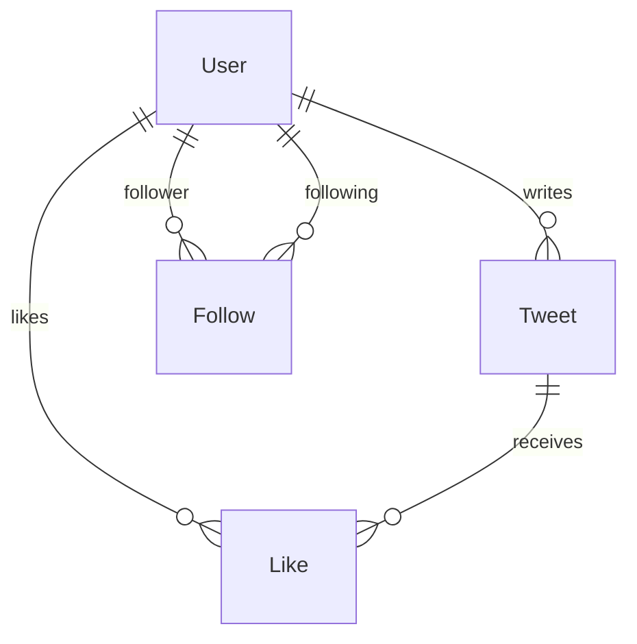

# Twitter/X Clone — Full-Stack

A full-stack Twitter/X clone built with TypeScript, featuring custom authentication, a social graph (follow/like system), paginated timeline, user search, responsive mobile-first design, and a Docker Compose production stack.

---

## Stack Justification

| Layer | Technology | Rationale |
|-------|-----------|-----------|
| **Runtime** | Node.js 24 | LTS, native ESM, excellent agentic tooling compatibility (tsx, vitest). |
| **Language** | TypeScript (strict) | End-to-end type safety across backend and frontend; reduces context-switching for AI agents. |
| **Backend framework** | Express.js 5 | Minimal, widely understood routing layer; no magic — easy for an agent to reason about request/response flow. |
| **ORM** | Prisma 6 | Declarative schema → type-safe client generation; ideal for rapid schema evolution and migrations. Supports SQLite (dev) and PostgreSQL (Docker). |
| **Frontend** | React 19 + Vite 6 | Component model maps naturally to UI state; Vite provides instant HMR and first-class TypeScript/JSX support. |
| **Styling** | Vanilla CSS (mobile-first) | Zero-dependency approach to custom dark theme, radial gradients, micro-animations (likePop, fadeIn), and three-breakpoint responsive layout. |
| **Auth** | Custom (bcryptjs + jsonwebtoken) | Mandated by challenge constraints. No external auth services. Passwords hashed with bcrypt (salt rounds: 10), sessions via JWT Bearer tokens (7-day expiry). |
| **Testing (unit/integration)** | Vitest + Supertest | Blazing-fast native ESM test runner. Supertest provides HTTP assertions without spinning up a full server. |
| **Testing (E2E)** | Playwright | Industry-standard browser automation; covers auth, tweet creation, follow/like flows. |
| **Containerization** | Docker Compose | Single-command production stack with PostgreSQL 16, backend, and nginx-served frontend. |

---

## Architecture Decisions

### Timeline Query Model

The home timeline displays tweets from the authenticated user and users they follow, sorted reverse-chronologically. The query uses a single SQL `IN` clause rather than a join graph walk:

```sql
SELECT t.*, u.username, u.name, u.avatarUrl
FROM tweets t
JOIN users u ON t.userId = u.id
WHERE t.userId IN (
    SELECT followingId FROM follows WHERE followerId = :currentUserId
) OR t.userId = :currentUserId
ORDER BY t.createdAt DESC
LIMIT :limit OFFSET :offset;
```

Pagination is offset-based (`limit` / `offset` query params, max 100 per page), enabling a "Load More" UX on the frontend.

### Social Graph: Follows & Likes

Two join tables model the social graph, each with a **composite unique constraint** to prevent duplicates at the database level:

- **Follows** — `@@unique([followerId, followingId])`. Self-referential many-to-many on `User`. The controller rejects self-follows before the DB query.
- **Likes** — `@@unique([userId, tweetId])`. Links `User` ↔ `Tweet`. Like/unlike toggles are idempotent; the API returns the current `likesCount` on every mutation.



### Responsive Layout

Mobile-first CSS with three breakpoints:

| Breakpoint | Layout |
|-----------|--------|
| < 640px | Bottom navigation bar, single-column content |
| 640–1024px | Compact sidebar (icons only), single-column content |
| > 1024px | Full sidebar (icons + labels), right sidebar (search + trends) |

---

## Custom Auth Flow

1. **Registration** — Client sends `{ email, username, password, name }`. Backend validates format (email regex, username ≥ 3 chars / alphanumeric, password ≥ 6 chars), checks uniqueness of email and username, hashes password with `bcrypt.genSalt(10)` + `bcrypt.hash()`, stores user, returns a signed JWT.
2. **Login** — Client sends `{ emailOrUsername, password }`. Backend looks up user by email or username (case-insensitive), compares hash with `bcrypt.compare()`, returns a signed JWT on success.
3. **Session** — The JWT (7-day expiry, signed with `JWT_SECRET`) is stored in `localStorage` and sent as `Authorization: Bearer <token>` on every authenticated request.
4. **Middleware** — `authMiddleware.ts` extracts the token, verifies with `jwt.verify()`, fetches the user from the database, and attaches the safe user object to `req.user`. Protected routes return 401 if the token is missing, invalid, or expired.
5. **Logout** — Stateless: the frontend removes the token from `localStorage`. The backend clears the `Set-Cookie` header (if using cookies) and returns a confirmation.

---

## AI Tooling & Development Process

This project was built using **Specification-Driven Development (SDD)** with two cooperative agentic AI systems:

1. **Orchestrator Agent (DeepSeek / Claude)** — Reads the SDD, plans the next phase, delegates implementation to the Worker Agent, reviews the output, verifies tests, and commits.
2. **Worker Agent (specialized tool-calling)** — Executes implementation tasks: writes code, runs tests, lints, and reports results back to the Orchestrator.

Each phase follows the **GitHub Spec Kit** pattern — `Specify → Plan → Tasks → Implement` — with progressive, unsquashed commits. The SDD (`SDD.md`) served as the single source of truth for all architectural decisions, ensuring context was preserved across agent sessions.

---

## Project Structure

```
├── backend/
│   ├── prisma/
│   │   ├── schema.prisma          # SQLite schema (local dev)
│   │   ├── schema.postgres.prisma # PostgreSQL schema (Docker)
│   │   └── seed.ts                # Seed script (12 users, 36 tweets)
│   ├── src/
│   │   ├── controllers/           # Route handlers
│   │   ├── middlewares/           # Auth middleware
│   │   ├── routes/               # Express routers
│   │   ├── tests/                # Backend integration tests (74)
│   │   ├── app.ts                # Express app setup
│   │   ├── config.ts             # JWT secret config
│   │   ├── db.ts                 # Prisma client singleton
│   │   └── index.ts              # Server entry point
│   ├── Dockerfile
│   └── package.json
├── frontend/
│   ├── e2e/                      # Playwright E2E tests (4 specs)
│   ├── src/
│   │   ├── components/           # React components
│   │   ├── context/              # Auth context
│   │   ├── tests/                # Frontend integration tests (35)
│   │   └── index.css             # Mobile-first responsive CSS
│   ├── nginx.conf                # Production nginx proxy config
│   ├── Dockerfile
│   ├── playwright.config.ts
│   └── package.json
├── docker-compose.yml            # PostgreSQL + backend + frontend
├── .env.example                  # Environment variable template
├── SDD.md                        # Software Design Document
└── README.md
```
