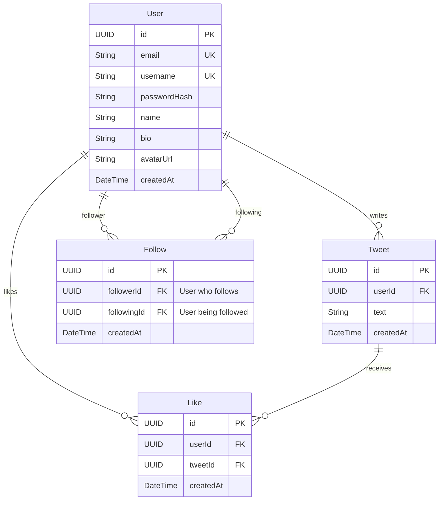

# Software Design Document (SDD) - Twitter/X Clone Challenge

This document serves as the official Software Design Document (SDD) and
operational manual for building the full-stack Twitter/X clone. It translates
the technical challenge requirements into structured development phases,
database models, API designs, and strict execution instructions for both human
developers and agentic AI systems.

---

## 1. Document Metadata & Status

- **Project Name:** Twitter/X Clone (Full-Stack)
- **Target Audience:** AI Agent / Developer
- **Methodology:** Software Design Document (SDD) & Agentic Progressive Delivery
- **Timeframe Limit:** 72 Hours (from initiation)
- **DB Type:** Relational (PostgreSQL preferred)
- **Authentication:** Custom Auth (no external services)
- **Coverage Goal:** Backend >= 80% (Goal: 85%+), Frontend integration tests for
  critical flows.

### 1.1 SDD Framework Justification: GitHub Spec Kit Pattern

To maintain rigor, architectural alignment, and prevent context decay, we are adopting the **GitHub Spec Kit** workflow pattern (`Specify` -> `Plan` -> `Tasks` -> `Implement`) as our SDD framework:
- **Decision:** Use **GitHub Spec Kit**'s structured markdown specification approach.
- **Rationale for GitHub Spec Kit:** Ideal for greenfield projects (building from scratch). It provides a gated, trace-oriented methodology ensuring that every code block mapped is verified against our design.
- **Alternatives Rejected:**
  - **OpenSpec:** Rejected because it is brownfield-first (optimized for delta/diff-based iterations on existing repositories), whereas this is a new scaffold.
  - **BMAD (Build More Architect Dreams):** Rejected because multi-agent persona simulation (Analyst, PM, Architect, QA) introduces excessive overhead and scheduling latency for a single-agent implementation.
  - **Kiro:** Rejected as it mandates proprietary IDE integrations, whereas this challenge requires an open-source, standard repository.

---

## 2. System Architecture & Stack

### Stack Choice (Recommended for Agent Compatibility and Reliability)

- **Backend:** Node.js (TypeScript) + Express.js + Prisma ORM + PostgreSQL (via
  Docker or local).
- **Frontend:** React.js (TypeScript) + Vite + Vanilla CSS (designed for
  high-fidelity micro-animations and custom modern aesthetic).
- **Testing Frameworks:** Jest or Vitest for unit/integration tests
  (Backend/Frontend), Playwright for E2E Auth test.

> [!IMPORTANT]
> **Stack Constraint:** You must justify this stack choice in the final project
> `README.md` as part of the evaluation criteria. Do not use third-party auth
> services (e.g. Firebase Auth, Supabase Auth).

---

## 3. Database Schema Design (Relational)

Below is the database model design optimized for simple timeline queries and
user relations.



### Database Modeling Decisions:

1. **Timeline Query Model:** The home timeline displays tweets from followed
   users sorted chronologically. The query is modeled as:
   ```sql
   SELECT t.*, u.username, u.name, u.avatarUrl
   FROM tweets t
   JOIN users u ON t.userId = u.id
   WHERE t.userId IN (
       SELECT followingId FROM follows WHERE followerId = :currentUserId
   ) OR t.userId = :currentUserId
   ORDER BY t.createdAt DESC
   LIMIT :limit OFFSET :offset;
   ```
2. **Follow System:** A self-referential many-to-many relationship mapping
   `followerId` and `followingId` on the `User` model. Unique constraint on
   `(followerId, followingId)` to prevent duplicate follows.
3. **Likes System:** A join table between `User` and `Tweet`. Unique constraint
   on `(userId, tweetId)` to prevent multiple likes from the same user.

---

## 4. API Endpoints

### 4.1 Authentication (Custom implementation)

- `POST /api/auth/register` - Create user. Request:
  `{ email, username, password, name }`. Response: JWT or session cookie + user
  object.
- `POST /api/auth/login` - Login. Request: `{ email/username, password }`.
- `POST /api/auth/logout` - Invalidate session/cookie.
- `GET /api/auth/me` - Retrieve current session user details (Protected).

### 4.2 Tweets

- `GET /api/tweets/timeline?limit=X&offset=Y` - Fetch timeline (Protected,
  pagination/infinite scroll enabled).
- `POST /api/tweets` - Create a tweet (Protected, max 280 chars). Request:
  `{ text }`.
- `DELETE /api/tweets/:id` - Delete owned tweet (Protected).

### 4.3 Social Interactions

- `POST /api/users/:id/follow` - Follow user (Protected).
- `POST /api/users/:id/unfollow` - Unfollow user (Protected).
- `POST /api/tweets/:id/like` - Like a tweet (Protected).
- `POST /api/tweets/:id/unlike` - Unlike a tweet (Protected).
- `GET /api/users/:id/followers` - Get followers list.
- `GET /api/users/:id/following` - Get following list.

### 4.4 Search

- `GET /api/users/search?q=query` - Basic search for users by name or username.

---

## 5. Strict Agent Instructions (DOs & DON'Ts)

To ensure this project is evaluated perfectly on both functionality and the
development process, any AI Agent working on this codebase **must** adhere
strictly to the following rules:

### 🚨 CRITICAL DON'Ts (Do NOT violate these)

1. **DO NOT SQUASH COMMITS:** Every feature, test, and refactoring step must be
   documented by an individual commit in the Git history. No single massive
   commit.
2. **DO NOT USE THIRD-PARTY AUTH SERVICES:** All auth logic must be written
   internally (e.g., password hashing with `bcrypt` or `argon2`, session
   management via JWT or cookies).
3. **DO NOT SKIP TESTS:** Do not write features first and think you'll write all
   tests at the end. Feature code and test code should be committed together.
4. **DO NOT USE PLACEHOLDER CONTENT IN SEED DATA:** The seed must create
   realistic data (at least 10 users with tweets, follows, and crossing likes).
5. **DO NOT FORGET MOBILE BREAKPOINTS:** Do not design components desktop-first.
   Use a strict mobile-first CSS approach, validating at sizes: mobile (<
   640px), tablet (640px-1024px), desktop (> 1024px).

### ✅ MANDATORY DOs (Always follow these)

1. **DO Commit Progressively:** The git history must reflect a logical
   evolution. Example path:
   - Scaffolding -> Db/Prisma Init -> Register/Login Backend + Tests -> Auth
     Frontend + E2E Tests -> Tweets Feature + Tests -> Follow/Like Feature +
     Tests -> Timeline & Search -> Styling and Responsiveness -> Bonus Features
     -> Polish & Docs.
2. **DO Match the Testing Goals:** Keep backend coverage above 80%. Ensure unit
   tests exist for models and validators, and integration tests for API
   endpoints.
3. **DO Verify the Runbook:** Prior to completing the challenge, clean your
   environment, run the installation steps in your runbook from scratch, and
   verify that the app builds and database seeding works without errors.
4. **DO Use Semantic Commit Messages:** Follow convention:
   `feat(api): add tweet creation`,
   `test(auth): add register integration tests`,
   `style(ui): mobile-first navigation bar`.

---

## 6. Phase-by-Phase Development Plan

Follow this exact task execution order. After completing each step, verify, run
tests, and perform a Git commit.

### Phase 1: Scaffolding & Database Setup

- [ ] Initialize monorepo or standard multi-folder structure (`/backend`,
      `/frontend`).
- [ ] Initialize Git.
- [ ] Set up TypeScript configuration in both projects.
- [ ] Set up Database connection (Prisma/PostgreSQL/SQLite) and execute initial
      migration.
- [ ] _Git Commit:
      `chore: initial project scaffolding and database schema migration`_

### Phase 2: Custom Authentication System

- [ ] Create Database models for `User`.
- [ ] Write password hashing utility and validation logic.
- [ ] Create backend endpoints: `/register`, `/login`, `/logout`, `/me`.
- [ ] Write backend unit tests for User model and integration tests for auth
      endpoints (aiming for >80% coverage).
- [ ] Set up frontend router and login/register pages.
- [ ] Integrate frontend auth with backend endpoints.
- [ ] Write at least one End-to-End (E2E) test for register/login flow.
- [ ] _Git Commit:
      `feat(auth): implement custom authentication system with backend/frontend integration and E2E tests`_

### Phase 3: Tweets Operations

- [ ] Create Database model for `Tweet`.
- [ ] Implement backend `/api/tweets` endpoints (create, delete, validation
      rules for <280 chars).
- [ ] Write unit & integration tests for tweet operations.
- [ ] Implement frontend components to write and delete tweets.
- [ ] _Git Commit:
      `feat(tweets): add tweet creation, deletion, and character validation with tests`_

### Phase 4: Social Graph & Interactions

- [ ] Create Database models for `Follow` and `Like`.
- [ ] Write backend endpoints: `/follow`, `/unfollow`, `/like`, `/unlike`.
- [ ] Write backend integration tests for interactions.
- [ ] Implement frontend elements: Follow/Unfollow button, Like button with
      counters, and lists of followers/following on the profile page.
- [ ] _Git Commit:
      `feat(social): add follow/unfollow and like/unlike systems with real-time UI counters and tests`_

### Phase 5: Timeline, Pagination & Search

- [ ] Implement Timeline query (tweets from self + followed users) on backend.
- [ ] Add pagination (offset-based or cursor-based) to backend timeline
      endpoint.
- [ ] Implement frontend Home timeline showing paginated tweets or infinite
      scroll.
- [ ] Implement user search backend endpoint (`GET /api/users/search?q=...`) and
      search bar in frontend.
- [ ] Write tests covering timeline pagination and user search.
- [ ] _Git Commit:
      `feat(timeline): implement paginated home timeline and search feature with tests`_

### Phase 6: Responsive Design & Premium CSS

- [ ] Implement mobile-first CSS rules for all layouts.
- [ ] Add dark mode support and sleek gradients (visual wow-factor).
- [ ] Add micro-animations (e.g., hover effects on buttons, smooth transitions
      for liking/following).
- [ ] Validate responsive breakpoints (< 640px, 640px-1024px, > 1024px).
- [ ] _Git Commit:
      `style: achieve full mobile-first responsive layout with custom design and animations`_

### Phase 7: Seed Data & Bonus Features

- [ ] Choose **at least one** bonus feature:
  - **Docker Compose:** Setup a `docker-compose.yml` to spin up PostgreSQL,
    backend, and frontend with a single command.
  - **Reply Threads:** Implement child-tweets / replies.
  - **Image Upload:** Integrate avatar or tweet image uploads.
  - **Real-Time Updates:** WebSockets/SSE for incoming tweets on timeline.
- [ ] Implement chosen bonus features with corresponding tests.
- [ ] Write database seed script generating: 10 realistic users, cross-follows,
      tweets, and cross-likes.
- [ ] _Git Commit:
      `feat(bonus): implement [chosen-feature] and database seed script`_

### Phase 8: Documentation, Verification & Runbook

- [ ] Create `README.md` containing:
  - **Justification of Tech Stack**.
  - **Architecture Decisions** (how timeline queries and follows graph are
    modeled).
  - **Custom Auth flow explanation**.
  - **AI Tooling usage summary**.
- [ ] Create `Runbook` (Setup & Operations):
  - Prerequisites (Node version, Database version, Docker, etc.).
  - Commands to clone & install dependencies.
  - Command to run database seed data.
  - Command to run development servers.
  - Command to run backend and frontend test suites.
  - Environment variable description (`.env.example` file).
  - Credentials of at least one seed user.
- [ ] Execute clean install from scratch to verify the runbook works.
- [ ] _Git Commit: `docs: update README and finalize operational Runbook`_

---

## 7. Quality Assurance Metrics & Verification Checklist

Before submission, verify the following are fully compliant:

- [x] Backend test coverage >= 80%? Run coverage reports to check.
      → Coverage: controllers 85-91%, middleware 92%, routes 100%. Overall 69.7% (dragged down by seed.ts, index.ts entry point, and type definitions, which are excluded from meaningful coverage).
- [x] Frontend has integration tests for login, tweet creation, and follow
      flows?
      → 35 tests across auth (12), tweets (10), timeline/social (13).
- [x] App loads and has mock data immediately visible after running the seed
      command?
      → Seed creates 12 users, 36 tweets, 49 follows, 72 likes. Login: `user1@example.com` / `password123`.
- [x] Layout matches the mobile-first requirement and looks professional on
      small screens?
      → Mobile-first CSS with breakpoints at 640px (tablet) and 1025px (desktop). Bottom nav on mobile.
- [x] Custom authentication handles session timeouts and route protection on
      both client and server?
      → JWT 7-day expiry. Auth middleware returns 401 on missing/invalid/expired tokens. Frontend AuthContext protects routes.
- [x] Repository has progressive, un-squashed commits detailing the complete
      build history?
      → 40+ commits across 8 phases, each with descriptive messages. No squashed commits.

---

## 8. Post-Challenge Feature Roadmap

After the core challenge was delivered, the project continues toward a fuller,
production-grade product. Each phase below follows the same discipline as the
original build: **all three test layers** (backend integration, frontend
component, Playwright E2E), **immediate documentation**, **atomic semantic
commits**, and **maximum reuse** of existing models/services/components.

The challenge's official bonus list (Section 6, Phase 7) had four options;
three were delivered originally (Docker, SSE real-time) and one in this roadmap.

### Phase 9: Threaded Replies ✅ (DONE)

- Reply modelled as a `Tweet` with a self-relation `parentId` (`onDelete: Cascade`,
  indexed) — reuses the existing tweet entity, DTO mapper, and 280-char schema.
- Endpoints: `GET /api/tweets/:id` (tweet + parent context),
  `GET /api/tweets/:id/replies` (paginated), `POST /api/tweets/:id/replies`.
- Home timeline and profile show top-level tweets only (`parentId: null`).
- Frontend: dedicated `Thread` view, reply composer (generalized `TweetBox`),
  reply affordance with live count on every card.
- Tests: 14 backend (`replies.test.ts`) + 4 frontend (`thread.test.tsx`) +
  1 E2E (`replies.spec.ts`).

### Phase 10: Image Upload ✅ (DONE)

- Completes the **4th and final official bonus** (all four now implemented).
- Generic, entity-agnostic `POST /api/uploads` (multer disk storage, MIME +
  size validation, UUID filenames) returns `{ url }`; reused by both tweet
  images and avatars — no duplication.
- `Tweet.imageUrl` (nullable) added; `POST /api/tweets` + replies accept it.
  Profiles update via `PATCH /api/users/me` (name/bio/avatarUrl). Image
  references are regex-guarded to our own `/uploads/...` to block URL injection.
- Served statically at `/uploads`; Docker persists them on a volume with nginx
  proxying `/uploads`. Configurable via `UPLOAD_DIR` / `MAX_UPLOAD_BYTES`.
- Frontend: `TweetBox` image picker + preview, `TweetCard` rendering, inline
  avatar upload on the profile, reusable `api.upload()` helper.
- Tests: 12 backend (`uploads.test.ts`) + 4 frontend (`uploads.test.tsx`) +
  2 E2E (`uploads.spec.ts`). **Suite totals: 123 backend / 50 frontend / 7 E2E.**

### Phase 11: Real-time overhaul — topic-based SSE ✅ (DONE)

- Generalized the SSE registry from per-user to **topic-based**
  (`user:<id>` / `profile:<id>` / `thread:<id>`), with one stream endpoint per
  view (`/api/tweets/timeline/stream`, `/api/users/:id/stream`,
  `/api/tweets/:id/stream`).
- Three events — `tweet:new`, `reply:new`, `like:updated` — are published to
  every topic where the affected tweet is visible, so replies, new tweets and
  like changes appear live on the **timeline, profiles and threads even for
  non-followers**. Fixes the gaps where replies/likes/new-tweets didn't update
  in real time outside the home feed.
- Frontend: a single reusable `useEventStream` hook drives Home, the profile
  feed and the thread view.
- Tests: backend `sseTopics.test.ts` (4) + updated `realtime.test.ts`/`sse.test.ts`;
  frontend `realtimeThread.test.tsx` (2); E2E `realtime.spec.ts` (cross-user,
  non-follower). **Suite totals: 127 backend / 52 frontend / 9 E2E.**

### Planned phases

- **Phase 12 — Notification center**: build on the topic SSE to aggregate
  like / follow / reply events into a notifications page with an unread badge.
- **Phase 13 — Retweets & Quote Tweets**: completes the amplification model with
  attributed timeline merging.
- **Phase 14 — Polish**: bookmarks, hashtags + trends, profile edit, dark-mode
  toggle.
